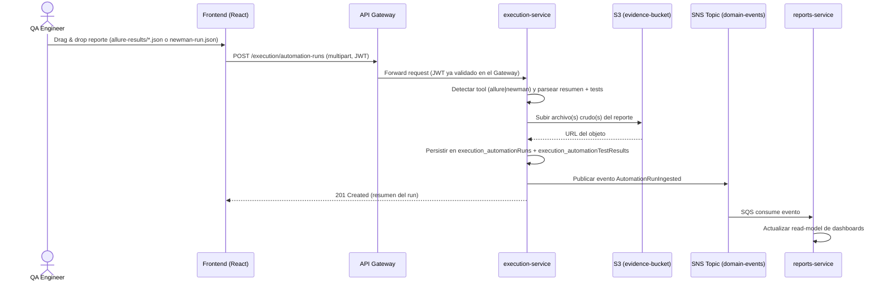
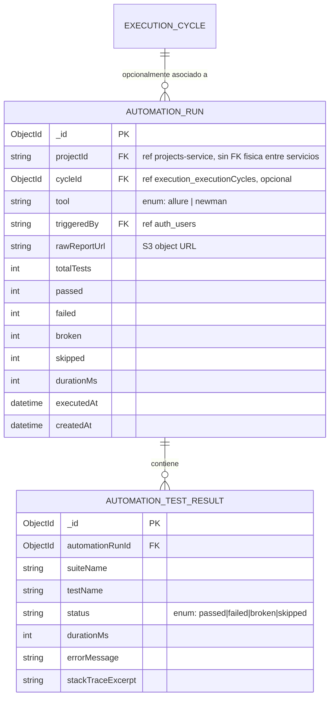

*[Elaborado por: Software Architect Senior]*

# QUALIGUALI — Arquitectura Técnica v1.2

Actualiza `QualiGuali_Arquitectura_v1.1.md` (que a su vez extendía el SDLC v1.0 heredado). Esta versión **revierte dos decisiones que estaban cerradas en v1.0** a pedido explícito del negocio. Todo lo demás de v1.0/v1.1 (stack, servicios, identidad visual, módulos de automatización, dashboard de reportes) se mantiene sin cambios.

## Registro de decisiones de arquitectura (nuevas)

| ID | Decisión anterior (v1.0) | Decisión nueva (v1.2) | Motivo |
| --- | --- | --- | --- |
| AD-001 | Multi-cliente (SaaS): entidad `Client`, aislamiento por `clientId` en todos los servicios | **Single-tenant**: no existe `Client`, no hay aislamiento por organización. La plataforma es de un solo espacio de trabajo | Definición de negocio: no se necesita SaaS multi-cliente |
| AD-002 | Cada microservicio con su propia base MongoDB (`auth_db`, `projects_db`, `qa_core_db`, `execution_db`, `defects_db`, `reports_db`) | **Una sola base MongoDB compartida** (`qualiguali`), con colecciones nombradas por prefijo de servicio (`auth_*`, `projects_*`, `qacore_*`, `execution_*`, `defects_*`, `reports_*`). Se mantienen los 6 microservicios como código y despliegue separados — cada uno solo lee/escribe sus propias colecciones, sin acceso cruzado | Definición de negocio: reducir infraestructura a administrar; no se necesitan 6 bases físicas para el volumen esperado |

Impacto: se eliminan todas las referencias a `clientId` y a `Client` en cualquier modelo de datos. Se elimina la variable de entorno de conexión por servicio (`AUTH_MONGO_URI`, `PROJECTS_MONGO_URI`, etc.) a favor de una única `MONGODB_URI` compartida (documentada en cada `.env.example`, apuntando todas al mismo valor en desarrollo local).

`[DECISIÓN PENDIENTE]` Si en el futuro se necesita volver a un modelo multi-cliente o separar bases por motivos de escala/seguridad, evaluar en ese momento — no se diseña ahora "por las dudas".

---

# [08] Módulos: Automatización Frontend y Automatización Backend

(Sin cambios de alcance funcional respecto a v1.1 — solo cambian los nombres de colección y se elimina cualquier referencia a `clientId`, que en v1.1 no existía de todas formas en este módulo.)

## 8.1 Alcance funcional

- **Automatización Frontend**: ingesta y visualización de resultados de suites E2E (Playwright/Cypress) reportados en formato **Allure**.
- **Automatización Backend**: ingesta y visualización de resultados de colecciones de API ejecutadas con **Newman** (Postman CLI).
- **Fase actual (MVP)**: carga 100% manual, drag-and-drop en la UI.
- **Fase futura**: ingesta automática por webhook desde CI (no incluida en el MVP).

Trazabilidad: `REQ-001`, `REQ-002`, `REQ-003`.

## 8.2 Decisión de arquitectura: dónde vive esto

**[DECISIÓN DE ARQUITECTURA — SA]** Los dos módulos se implementan como una extensión de `execution-service` (sin cambios respecto a v1.1). Con AD-002, además, sus colecciones viven en la base compartida `qualiguali`, prefijadas `execution_*`, igual que el resto de las colecciones de este servicio.

## 8.3 Flujo de ingesta (carga manual)



## 8.4 Formatos de entrada soportados (MVP)

Sin cambios respecto a v1.1: Allure vía `allure-results/*.json` crudo; Newman vía JSON del reporter estándar.

`[DECISIÓN PENDIENTE]` Límite de tamaño de archivo por upload — recomendado 50 MB.

---

# [09] Modelo de datos — Adenda en la base compartida `qualiguali`

## 9.1 ERD



## 9.2 Diccionario de datos

### Colección `execution_automationRuns`

| Campo | Tipo | Restricciones | Índice |
| --- | --- | --- | --- |
| `_id` | ObjectId | PK, autogenerado | — |
| `projectId` | String | Requerido. Referencia lógica a `projects_projects` (otro servicio) — se valida vía API síncrona al crear, no hay FK física | Índice simple |
| `cycleId` | ObjectId | Opcional. Referencia lógica a `execution_executionCycles` (mismo servicio) | Índice simple |
| `tool` | String enum | Requerido. Valores: `allure`, `newman` | Índice simple |
| `triggeredBy` | String | Requerido. Referencia lógica a `auth_users` | — |
| `rawReportUrl` | String (URL) | Requerido | — |
| `totalTests` | Number | Requerido, ≥ 0 | — |
| `passed` | Number | Requerido, ≥ 0 | — |
| `failed` | Number | Requerido, ≥ 0 | — |
| `broken` | Number | Default 0, ≥ 0 (solo Allure) | — |
| `skipped` | Number | Default 0, ≥ 0 | — |
| `durationMs` | Number | Requerido, ≥ 0 | — |
| `executedAt` | Date | Requerido (timestamp real de la corrida, extraído del reporte) | Índice simple |
| `createdAt` | Date | Autogenerado | — |

Índice compuesto: `{ projectId: 1, tool: 1, executedAt: -1 }`.

### Colección `execution_automationTestResults`

| Campo | Tipo | Restricciones | Índice |
| --- | --- | --- | --- |
| `_id` | ObjectId | PK, autogenerado | — |
| `automationRunId` | ObjectId | Requerido, FK a `execution_automationRuns._id` | Índice simple |
| `suiteName` | String | Requerido | — |
| `testName` | String | Requerido | — |
| `status` | String enum | Requerido: `passed`, `failed`, `broken`, `skipped` | Índice simple |
| `durationMs` | Number | Requerido, ≥ 0 | — |
| `errorMessage` | String | Opcional | — |
| `stackTraceExcerpt` | String | Opcional, truncado a 2000 caracteres | — |

Índice compuesto: `{ automationRunId: 1, status: 1 }`.

## 9.3 Esquemas Mongoose (ORM inicial)

Todos los servicios se conectan a la misma `MONGODB_URI` (base `qualiguali`). El nombre de colección se fija explícitamente en cada modelo (tercer argumento de `mongoose.model`) para que coincida con la convención de prefijo por servicio, en vez de dejar que Mongoose lo infiera del nombre del modelo.

```javascript
// services/execution-service/src/models/AutomationRun.js
const mongoose = require('mongoose');

const AutomationRunSchema = new mongoose.Schema({
  projectId: { type: String, required: true, index: true },
  cycleId: { type: mongoose.Schema.Types.ObjectId, ref: 'ExecutionCycle', default: null, index: true },
  tool: { type: String, enum: ['allure', 'newman'], required: true, index: true },
  triggeredBy: { type: String, required: true },
  rawReportUrl: { type: String, required: true },
  totalTests: { type: Number, required: true, min: 0 },
  passed: { type: Number, required: true, min: 0 },
  failed: { type: Number, required: true, min: 0 },
  broken: { type: Number, default: 0, min: 0 },
  skipped: { type: Number, default: 0, min: 0 },
  durationMs: { type: Number, required: true, min: 0 },
  executedAt: { type: Date, required: true, index: true },
}, { timestamps: { createdAt: true, updatedAt: false } });

AutomationRunSchema.index({ projectId: 1, tool: 1, executedAt: -1 });

module.exports = mongoose.model('AutomationRun', AutomationRunSchema, 'execution_automationRuns');
```

```javascript
// services/execution-service/src/models/AutomationTestResult.js
const mongoose = require('mongoose');

const AutomationTestResultSchema = new mongoose.Schema({
  automationRunId: { type: mongoose.Schema.Types.ObjectId, ref: 'AutomationRun', required: true, index: true },
  suiteName: { type: String, required: true },
  testName: { type: String, required: true },
  status: { type: String, enum: ['passed', 'failed', 'broken', 'skipped'], required: true },
  durationMs: { type: Number, required: true, min: 0 },
  errorMessage: { type: String, default: null },
  stackTraceExcerpt: { type: String, default: null, maxlength: 2000 },
});

AutomationTestResultSchema.index({ automationRunId: 1, status: 1 });

module.exports = mongoose.model('AutomationTestResult', AutomationTestResultSchema, 'execution_automationTestResults');
```

## 9.4 Evento de dominio (sin cambios)

```json
// AutomationRunIngested (publicado a SNS por execution-service)
{
  "eventType": "AutomationRunIngested",
  "automationRunId": "string",
  "projectId": "string",
  "cycleId": "string | null",
  "tool": "allure | newman",
  "summary": { "total": 0, "passed": 0, "failed": 0, "broken": 0, "skipped": 0 },
  "executedAt": "ISO-8601",
  "occurredAt": "ISO-8601"
}
```

---

# [10] Recomendación: visualización de reportes de ciclos de QA

Sin cambios respecto a v1.1 (AD-001/AD-002 no afectan el diseño del dashboard, solo dónde vive físicamente el dato). Ver `QualiGuali_Arquitectura_v1.1.md` §10 para el diagrama de flujo y el detalle de componentes de la pantalla — se mantiene vigente tal cual.

---

# [11] Requisitos y Historias de Usuario

Sin cambios respecto a v1.1 (`REQ-001` a `REQ-006`, `US-001` a `US-004`). Ver v1.1 §11.

---

# [12] Puntos abiertos y decisiones pendientes

Se agregan a los ya listados en v1.1 §12:

- `[DECISIÓN PENDIENTE]` Si con una sola base compartida conviene igualmente separar por *database* lógica dentro de la misma instancia Mongo (Mongo permite múltiples `db` en una instancia) en vez de una única `db` con colecciones prefijadas — se optó por colecciones prefijadas en una única `db` por simplicidad de conexión (una sola `MONGODB_URI` para los 6 servicios), pero es reversible sin tocar el modelo de datos si se decide lo contrario.

---

| **Estado del documento** Versión 1.2 · Julio 2026 · QualiGuali · Reemplaza AD-001/AD-002 de v1.0, extiende v1.1 en todo lo demás. Documento vivo. |
| --- |
